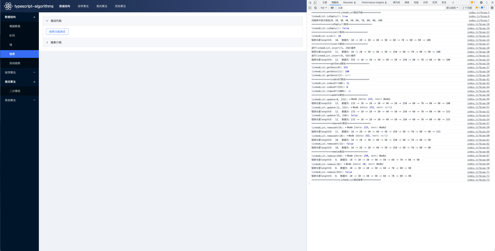
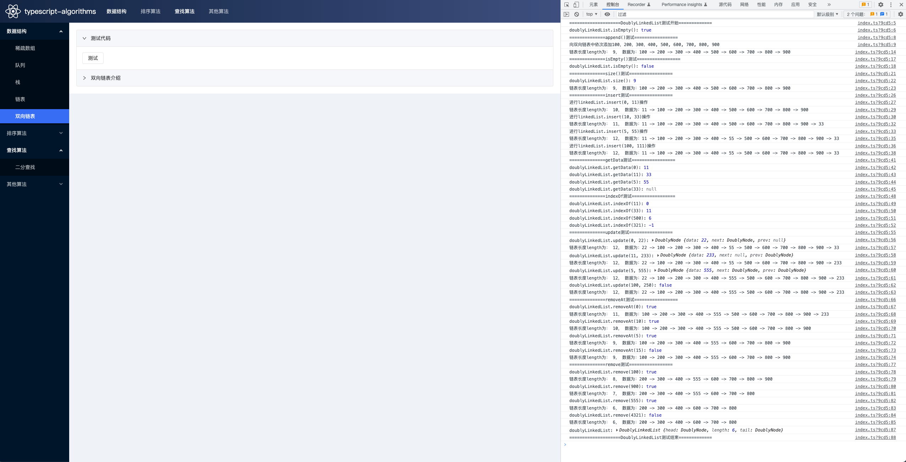
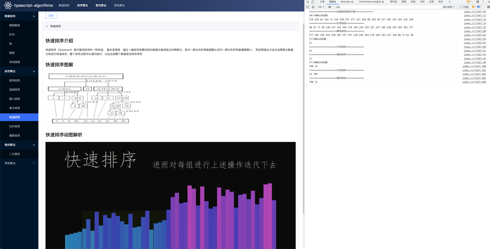
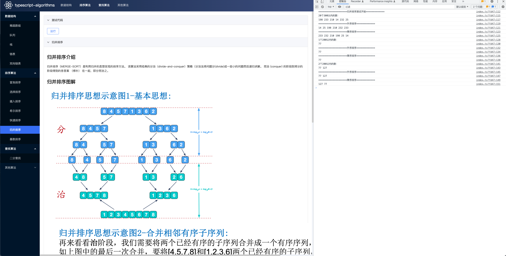
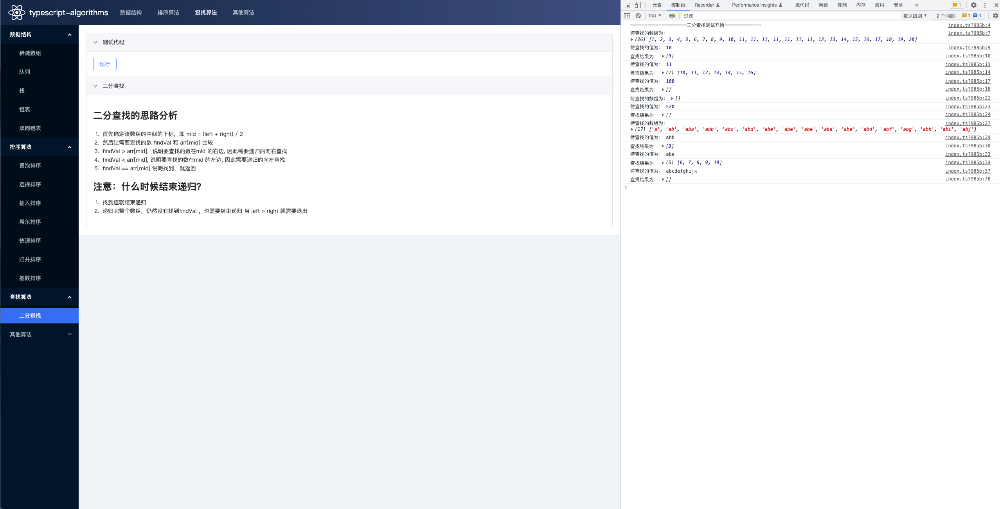

# TypeScript数据结构与算法

本仓库包含多种基于 TypeScript 的数据结构与算法。且每种数据结构或算法都提供了一个前端页面，让您可以借助浏览器的控制台更加详细和清晰地进行代码查看。

本项目基于一个React+React Hooks+TypeScript+Dva+Antd的前端开发模版进行开发,该开发模版是我根据Dva.js官网的模版进行改造的，更加适合大型项目的开发。

[前端开发模版GitHub地址](https://github.com/wangchen130/react-typescript-dva-antd-template)，欢迎大家提意见或下载使用，如果觉得好用麻烦大家动动你可爱的小手点个星星🌟，谢谢！。

## 安装依赖

```
npm run install
```

## 启动

```
npm run dev
```

## 项目结构

```
.
├── build 开发与打包配置
├── dist 打包输出目录
├── mock
├── src
│   ├── dode
│   │   ├── algorithms 算法
│   │   └── dataStructures 数据结构
│   ├── components
│   ├── config
│   ├── containers
│   ├── models
│   ├── pages
│   │   ├── algorithms 算法介绍和测试代码查看页面
│   │   └── dataStructures 数据结构介绍和测试代码查看页面
│   ├── public
│   ├── themes
│   └── utils 工具库
```

## pre-commit 和 eslint

- 执行 commit 时，会触发 hooks，调用 eslint 检测
- 出现大量规范错误，可以使用 npm run eslint:fix 进行修复

```
// 手动检测
npm run eslint

// 手动修复
npm run eslint:fix
```
## 项目运行部分效果展示

### 单链表



### 双向链表



### 快速排序



### 归并排序



### 二分查找


